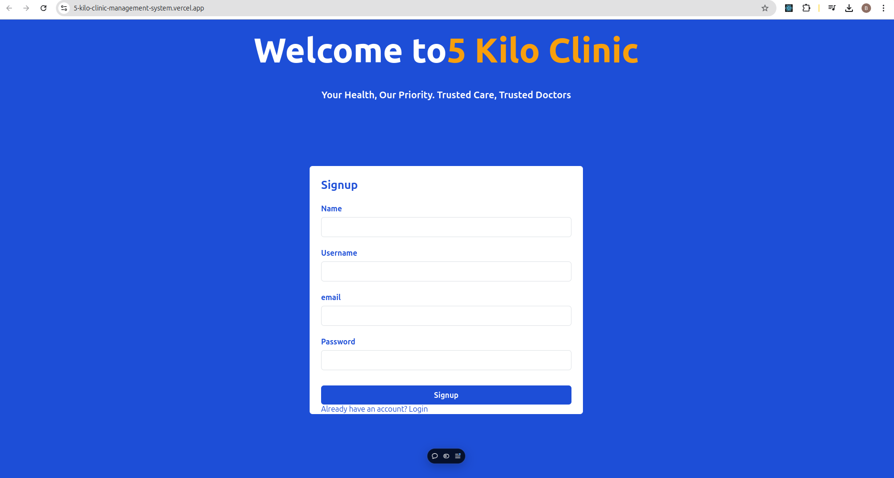

# 5 Kilo Clinic Management System

A clinic management system built with **React**, **Node.js**, and **Express**. This system allows doctors, patients, and admins to interact with each other efficiently. It helps manage appointments, patient details, and other clinic-related data.

## Live Demo

You can view the deployed version of the clinic management system by visiting the link below:

[**5 Kilo Clinic Management System - Live Demo**](https://5-kilo-clinic-management-system.vercel.app/)

## Video Demo

Watch a quick video walkthrough of the **5 Kilo Clinic Management System** to see how it works:

[**Video Demo**](clinic.mp4)

Alternatively, if your video is hosted on platforms like YouTube or Vimeo, you can embed it directly:

[](https://www.youtube.com/watch?v=YOUR_VIDEO_ID)

> Replace `YOUR_VIDEO_ID` with the actual video ID from YouTube or the link to your video file.

## Screenshot

Here is a screenshot of the **5 Kilo Clinic Management System**:



## Features

- **Admin Panel**:
  - Manage doctors and patients.
  - View and manage appointments.
  - Perform administrative tasks.

- **Doctor Panel**:
  - View assigned patients and their medical records.
  - Schedule and manage appointments.
  - Update patient records and prescriptions.

- **Patient Panel**:
  - Book appointments with doctors.
  - View personal medical records.
  - Receive appointment reminders.

## Technologies Used

- **Frontend**: React, React Router, Axios
- **Backend**: Node.js, Express.js
- **Database**: MongoDB
- **Authentication**: JWT (JSON Web Tokens) for secure user authentication
- **Styling**: CSS, Bootstrap (or any other framework you choose)

## Project Setup

### Prerequisites

Before you begin, ensure you have the following installed:

- **Node.js** (v14 or later)
- **MongoDB** (or a MongoDB cloud database)
- **npm** (Node Package Manager)

### 1. Clone the repository

Clone this repository to your local machine using:

```bash
git clone https://github.com/your-username/5-kilo-clinic-management-system.git
cd 5-kilo-clinic-management-system
